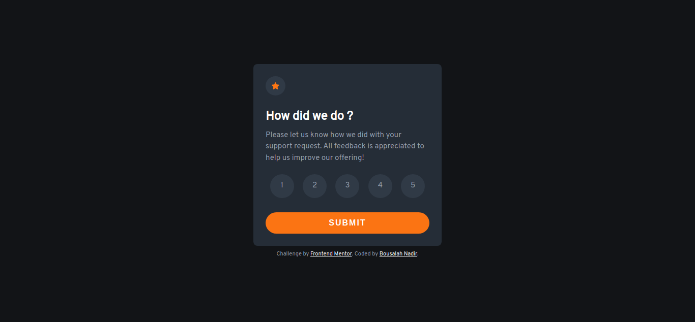
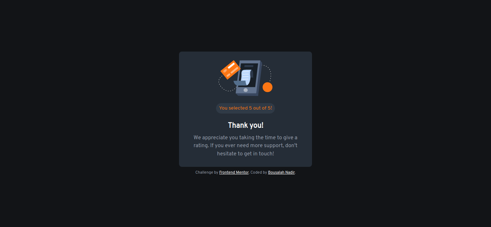
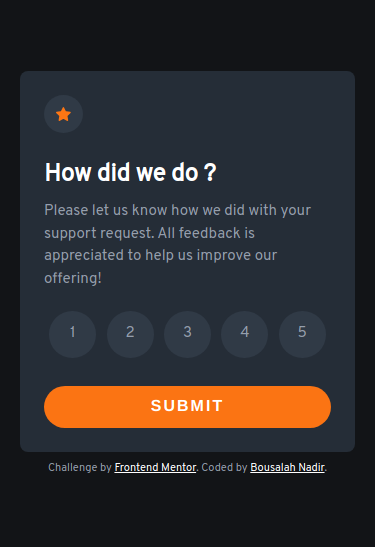
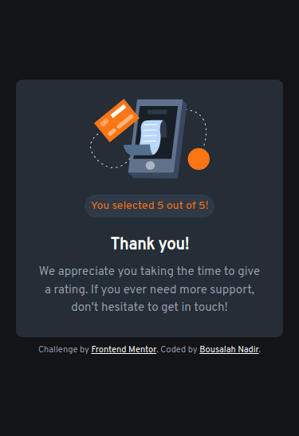

# Frontend-Mentor-Interactive-rating-component

This is a solution to the [Interactive rating component challenge on Frontend Mentor](https://www.frontendmentor.io/challenges/interactive-rating-component-koxpeBUmI). Frontend Mentor challenges help you improve your coding skills by building realistic projects. 

## Table of contents

- [Overview](#overview)
  - [The challenge](#the-challenge)
  - [Screenshot](#screenshot)
  - [Links](#links)
- [My process](#my-process)
  - [Built with](#built-with)
- [Author](#author)

## Overview

### The challenge

Users should be able to:

- View the optimal layout for the app depending on their device's screen size
- See hover states for all interactive elements on the page
- Select and submit a number rating
- See the "Thank you" card state after submitting a rating

### Screenshot

 ## Desktop
 
 

 ## Mobile

 
 

 ### Links

- Solution URL: [solution](https://your-solution-url.com)
- Live Site URL: [live site](https://github.com/Medido1/Frontend-Mentor-Interactive-rating-component)

## My process

### Built with

- Semantic HTML5 markup
- CSS custom properties
- Flexbox
- CSS Grid
- Mobile-first workflow
- Vanilla javascript

## Author

- Frontend Mentor - [@Medido1](https://www.frontendmentor.io/profile/Medido1)
- GitHub - [@Medido1](https://github.com/Medido1)